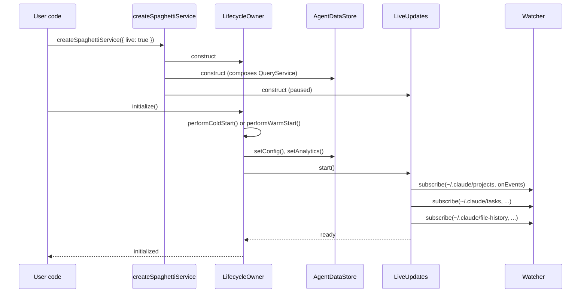

# Live Updates — Concrete Design

**Status:** Implementation design, companion to `docs/rfcs/005-live-updates.md`.
**Created:** 2026-04-20
**Scope:** Exact file layout, interface signatures, data flow, and phased migration for the live-updates work. The RFC is the "why + what"; this doc is the "here's exactly what changes."

---

## 1. Target file layout

New files marked `NEW`. Renamed files marked `RENAME`. Files that only gain methods marked `MODIFY`.

```
packages/sdk/src/
├── api.ts                              MODIFY    add live?: SpaghettiLive
├── app-service.ts                      MODIFY    expose .live delegate
├── create.ts                           MODIFY    wire LiveUpdates on opts.live
├── index.ts                            MODIFY    export Change, topics, hooks
├── native.ts                           MODIFY    add live_ingest_batch binding
├── settings.ts                         unchanged
├── data/
│   ├── agent-data-service.ts           RENAME→   lifecycle-owner.ts (was AgentDataServiceImpl)
│   ├── lifecycle-owner.ts              NEW       trimmed class: lifecycle + engine selection
│   ├── agent-data-store.ts             NEW       reads + caches + subscriber registry
│   ├── query-service.ts                MODIFY    becomes private; AgentDataStore composes it
│   ├── ingest-service.ts               MODIFY    adds writeBatch() for live path
│   └── idle-maintenance.ts             NEW       WAL checkpoint + FTS merge timer
├── live/                               NEW DIR
│   ├── index.ts                        NEW       public exports
│   ├── live-updates.ts                 NEW       orchestrator: watcher→queue→writer→emit
│   ├── watcher.ts                      NEW       @parcel/watcher wrapper + interface
│   ├── checkpoints.ts                  NEW       per-file offset store (persisted)
│   ├── coalescing-queue.ts             NEW       dedup-by-path, trailing-edge debounce
│   ├── incremental-parser.ts           NEW       byte-offset JSONL tail, reuses parser helpers
│   ├── router.ts                       NEW       path → category → handler lookup
│   ├── change-events.ts                NEW       Change union + type guards + topic types
│   └── subscriber-registry.ts          NEW       topic→Set<listener> fanout (belongs to store)
├── parser/                             unchanged (project-parser helpers exported for reuse)
├── react/
│   ├── live/                           NEW DIR
│   │   ├── use-live-session-messages.ts NEW
│   │   ├── use-live-session-list.ts    NEW
│   │   ├── use-live-settings.ts        NEW
│   │   └── use-live-changes.ts         NEW
│   └── index.ts                        MODIFY    export live hooks
└── types/                              unchanged

crates/spaghetti-napi/
├── src/
│   ├── lib.rs                          MODIFY    export live_ingest_batch
│   ├── live_ingest.rs                  NEW       wraps writer for live batches
│   └── writer.rs                       MODIFY    expose write_batch_with_tx(rows) reusable API
└── index.d.ts                          MODIFY    add types for live_ingest_batch
```

Nothing under `packages/cli/`, `packages/ui/`, `apps/`, or the plugins requires changes — they consume through the existing public API.

---

## 2. Interface contracts

### 2.1 `LifecycleOwner` (née `AgentDataServiceImpl`)

```ts
// data/lifecycle-owner.ts
export interface LifecycleOwnerOptions {
  dbPath?: string;
  claudeDir?: string;
  engine?: 'ts' | 'rust';
  live?: boolean;              // NEW: opt-in to live updates
}

export class LifecycleOwner extends EventEmitter {
  constructor(
    private fileService: FileService,
    private parser: ClaudeCodeParser,
    private ingestService: IngestService,
    private store: AgentDataStore,           // ← replaces direct QueryService
    private idleMaintenance: IdleMaintenance,
    private options: LifecycleOwnerOptions,
  );

  initialize(): Promise<void>;
  rebuild(): Promise<void>;
  shutdown(): Promise<void>;

  // exposed for SpaghettiAppService to delegate .live
  readonly live: LiveUpdates | null;
}
```

Removed responsibilities (moved to `AgentDataStore`): every `getX()` query method, `cachedConfig`, `cachedAnalytics`, `getConfig()`, `getAnalytics()`.

### 2.2 `AgentDataStore`

```ts
// data/agent-data-store.ts
export interface AgentDataStore {
  // lifecycle
  open(dbPath: string): Promise<void>;
  setConfig(config: AgentConfig): void;       // called by LifecycleOwner after parse
  setAnalytics(analytics: AgentAnalytic): void;

  // SQLite reads — these are today's QueryService methods, unchanged signatures
  getProjectSlugs(): string[];
  getProjectSummaries(): ProjectSummaryData[];
  getSessionSummaries(slug: string): SessionSummaryData[];
  getSessionMessages(slug: string, sessionId: string, limit: number, offset: number):
    PaginatedSegmentResult<SessionMessage>;
  getSessionSubagents(slug: string, sessionId: string):
    Array<{ agentId: string; agentType: string; messageCount: number }>;
  getSubagentMessages(slug: string, sessionId: string, agentId: string,
    limit: number, offset: number): PaginatedSegmentResult<SessionMessage>;
  getProjectMemory(slug: string): string | null;
  getSessionTodos(slug: string, sessionId: string): unknown[];
  getSessionPlan(slug: string, sessionId: string): unknown | null;
  getSessionTask(slug: string, sessionId: string): unknown | null;
  getToolResult(slug: string, sessionId: string, toolUseId: string): string | null;
  search(query: SearchQuery): SearchResultSet;

  // In-memory caches
  getConfig(): AgentConfig;
  getAnalytics(): AgentAnalytic;

  // Subscriber registry (used by LiveUpdates; public variant below via api.live)
  emit(change: Change): void;
  subscribe(
    topic: ChangeTopic | undefined,
    listener: (e: Change) => void,
    options?: { throttleMs?: number; latest?: boolean },
  ): Dispose;

  // Snapshot read for useSyncExternalStore
  getSnapshot<T>(selector: (store: AgentDataStore) => T): T;
  subscribeSnapshot(listener: () => void): Dispose;

  close(): void;
}
```

The subscriber registry is split into two internal data structures:

- `Map<TopicKey, Set<Listener>>` for scoped subscribers — key is e.g. `'session:slug:sessionId'`.
- `Set<Listener>` for firehose subscribers.

`emit` dispatches to firehose + matching scoped sets. Listener errors are caught and logged so one bad subscriber can't kill the loop.

### 2.3 `LiveUpdates`

```ts
// live/live-updates.ts
export interface LiveUpdatesOptions {
  claudeDir: string;
  batchWindowMs?: number;     // default 75
  maxBatchRows?: number;      // default 200
  debounceMs?: number;        // default 30, hard-flush at 200
  onError?: (err: Error) => void;
}

export class LiveUpdates {
  constructor(
    private watcher: Watcher,
    private checkpoints: CheckpointStore,
    private queue: CoalescingQueue,
    private parser: IncrementalParser,
    private ingestService: IngestService,
    private store: AgentDataStore,
    private nativeAddon: NativeAddon | null,
    private opts: Required<LiveUpdatesOptions>,
  );

  start(): Promise<void>;
  stop(): Promise<void>;

  // Public-API surface (re-exposed through api.live)
  onChange(
    listener: (e: Change) => void,
    options?: SubscribeOptions,
  ): Dispose;
  onChange(
    topic: ChangeTopic,
    listener: (e: Change) => void,
    options?: SubscribeOptions,
  ): Dispose;
  events(options?: { bufferSize?: number; onDrop?: (dropped: Change) => void }):
    AsyncIterable<Change>;

  // Lazy-attachment control
  prewarm(topic: ChangeTopic): Dispose;

  // Status
  isSaturated(): boolean;
  checkpointSummary(): { files: number; totalBytes: number };
}

export interface SubscribeOptions {
  throttleMs?: number;      // min gap between invocations
  latest?: boolean;         // true = drop intermediate; false = coalesce array (default true when throttleMs set)
}
```

`start()`:

1. Load checkpoints from `~/.claude/.spaghetti-live-state.json` (or empty if missing).
2. Spawn the writer loop (one async task) that drains the queue on the 75 ms window.
3. Resolve — **no watchers attached yet**. Watchers are ref-counted and attached on first `onChange` or `prewarm` call matching a given scope, detached when the ref count hits zero.

`stop()`:

1. Unsubscribe watchers.
2. Drain queue (with hard 2 s cap).
3. Persist checkpoints synchronously.
4. Mark the listener registry disposed so any in-flight events become no-ops.

### 2.4 `Watcher` interface + `@parcel/watcher` impl

```ts
// live/watcher.ts
export interface Watcher {
  subscribe(
    rootPath: string,
    onEvents: (events: WatchEvent[]) => void,
    options: { ignore: string[]; recursive: boolean }
  ): Promise<Unsubscribe>;

  writeSnapshot(rootPath: string, snapshotFile: string): Promise<void>;
  getEventsSince(rootPath: string, snapshotFile: string): Promise<WatchEvent[]>;
}

export type WatchEvent = {
  type: 'create' | 'update' | 'delete';
  path: string;
};
```

`createParcelWatcher()` is the default impl. `createChokidarWatcher()` is the fallback (wired only if parcel fails to load), providing the same interface minus `writeSnapshot`/`getEventsSince` (those degrade to "rescan on start").

### 2.5 `CheckpointStore`

```ts
// live/checkpoints.ts
export interface Checkpoint {
  path: string;
  inode: number;
  size: number;
  lastOffset: number;
  lastMtimeMs: number;
}

export interface CheckpointStore {
  get(path: string): Checkpoint | undefined;
  set(path: string, cp: Checkpoint): void;
  delete(path: string): void;

  load(): Promise<void>;       // from ~/.claude/.spaghetti-live-state.json
  flush(): Promise<void>;      // atomic-rename write; 2 s debounced internally
}
```

### 2.6 `CoalescingQueue`

```ts
// live/coalescing-queue.ts
export interface QueuedEvent {
  path: string;
  reason: 'append' | 'rewrite' | 'delete';
  enqueuedAt: number;
}

export interface CoalescingQueue {
  enqueue(evt: QueuedEvent): void;       // dedupes by path
  drain(maxRows: number, windowMs: number): Promise<QueuedEvent[]>;
  size(): number;
  saturated(): boolean;                   // true if stuck >5s
}
```

Dedup semantics: if a path is already enqueued, the reason collapses (rewrite beats append; delete beats both).

### 2.7 `IncrementalParser`

```ts
// live/incremental-parser.ts
export type ParsedRow =
  | { category: 'message';        slug: string; sessionId: string;
      message: SessionMessage;    msgIndex: number; byteOffset: number }
  | { category: 'subagent';       slug: string; sessionId: string;
      transcript: SubagentTranscript }
  | { category: 'tool_result';    slug: string; sessionId: string;
      result: PersistedToolResult }
  | { category: 'file_history';   sessionId: string;
      history: FileHistorySession }
  | { category: 'todo';           sessionId: string;
      todo: TodoFile }
  | { category: 'task';           sessionId: string;
      task: TaskEntry }
  | { category: 'plan';           slug: string;
      plan: PlanFile }
  | { category: 'project_memory'; slug: string;
      content: string }
  | { category: 'session_index';  slug: string;
      originalPath: string;       sessionsIndex: SessionsIndex };

export interface IncrementalParseResult {
  rows: ParsedRow[];
  newCheckpoint: Checkpoint;
  rewrite: boolean;
}

export interface ParseFileDeltaParams {
  path: string;
  category: ParsedRowCategory;
  slug?: string;
  sessionId?: string;
  checkpoint: Checkpoint | undefined;
  startMsgIndex?: number;   // message category only — continues msg_index across tail calls
  claudeDir?: string;       // task category only — so we can read .lock / .highwatermark
}

export interface IncrementalParser {
  parseFileDelta(params: ParseFileDeltaParams): Promise<IncrementalParseResult>;
}
```

Each variant's payload fields match the writer's corresponding `onX` method signature (and the downstream `Change` variant) verbatim, so `IngestService.writeBatch` dispatches by narrowing on `row.category` with no adapter types or `as` casts.

Internals reuse the existing `project-parser.ts` per-category conventions — the subagent / todo / file-history filename regexes are duplicated deliberately (same pattern, private to each module) rather than exported. JSONL message rows tail by byte offset via `file-service.ts`'s streaming reader (`fromBytePosition`); subagent files are small and get a full re-parse per change for correctness.

**Historical drift: 2026-04-20.** The first C2.4 landing used a thin `{ category, slug?, sessionId?, payload: unknown }` shape that let the parser stay category-agnostic. When C2.6 tried to dispatch those rows into `IngestService.onMessage(slug, sessionId, message, index, byteOffset)` and its siblings, the gap became structural: messages lost `msgIndex` + `byteOffset`, subagents needed one aggregated `SubagentTranscript` per file rather than one-row-per-line, tool-results / todos / file-history needed identifiers extracted from the filename, and plans needed `title` + `size` derived from content. The discriminated-union form above — each variant pre-shaped for the writer — is the resolution. See commits `ba682c4` (C2.4b, parser reshape) and `6a5171a` (C2.6b, writer dispatch) for the full move.

### 2.8 `Router`

```ts
// live/router.ts
export type Category =
  | 'session'          // projects/*/uuid.jsonl
  | 'session_index'    // projects/*/sessions-index.json
  | 'subagent'         // projects/*/<sid>/subagents/agent-*.jsonl
  | 'tool_result'      // projects/*/<sid>/tool-results/*.txt
  | 'project_memory'   // projects/*/memory/MEMORY.md
  | 'file_history'     // file-history/<sid>/<hash>@v<n>
  | 'todo'             // todos/<sid>-agent-*.json
  | 'task'             // tasks/<sid>/.lock|.highwatermark|<N>.json
  | 'plan'             // plans/*.md
  | 'settings'         // settings.json
  | 'settings_local'   // settings.local.json
  | 'ignored';

export function classify(path: string): { category: Category;
  slug?: string; sessionId?: string } | null;
```

One function, pure, heavily tested. No runtime branching elsewhere.

### 2.9 `Change` union + topics

```ts
// live/change-events.ts
export type Change =
  | { type: 'session.message.added';  seq: number; ts: number;
      slug: string; sessionId: string; message: SessionMessage; byteOffset: number }
  | { type: 'session.created';        seq: number; ts: number;
      slug: string; sessionId: string; entry: SessionIndexEntry }
  | { type: 'session.rewritten';      seq: number; ts: number;
      slug: string; sessionId: string }
  | { type: 'subagent.updated';       seq: number; ts: number;
      slug: string; sessionId: string; agentId: string; transcript: SubagentTranscript }
  | { type: 'tool-result.added';      seq: number; ts: number;
      slug: string; sessionId: string; toolUseId: string }
  | { type: 'file-history.added';     seq: number; ts: number;
      sessionId: string; hash: string; version: number }
  | { type: 'todo.updated';           seq: number; ts: number;
      sessionId: string; agentId: string; items: TodoItem[] }
  | { type: 'task.updated';           seq: number; ts: number;
      sessionId: string; task: TaskEntry }
  | { type: 'plan.upserted';          seq: number; ts: number;
      slug: string; plan: PlanFile }
  | { type: 'settings.changed';       seq: number; ts: number;
      file: 'settings' | 'settings.local'; settings: SettingsFile };

export type ChangeTopic =
  | { kind: 'session'; slug?: string; sessionId?: string }
  | { kind: 'subagent'; slug?: string; sessionId?: string; agentId?: string }
  | { kind: 'tool-result'; slug?: string; sessionId?: string }
  | { kind: 'file-history'; sessionId?: string }
  | { kind: 'todo'; sessionId?: string }
  | { kind: 'task'; sessionId?: string }
  | { kind: 'plan'; slug?: string }
  | { kind: 'settings' };

// Type guards per variant
export const isSessionMessageAdded = (c: Change): c is Extract<Change, { type: 'session.message.added' }> =>
  c.type === 'session.message.added';
// ... one per variant
```

Topic matching is precise: a subscription with `{ kind: 'session', slug }` receives every `session.*` event for that slug; omit `slug` to scope to all sessions; add `sessionId` to narrow further. Implemented as a series of `TopicKey` strings the emitter looks up.

### 2.10 `IngestService.writeBatch`

New method on the existing `IngestService`, used exclusively by `LiveUpdates`.

```ts
interface IngestService {
  // ... existing members ...

  writeBatch(rows: ParsedRow[]): Promise<WriteResult>;
}

interface WriteResult {
  changes: Change[];
  durationMs: number;     // wall time of the whole call
}
```

Implementation:

1. Empty-batch short-circuit: no transaction, return `{ changes: [], durationMs }`.
2. `BEGIN IMMEDIATE` (acquire the write lock up front).
3. `switch (row.category)` — discriminated-union narrowing feeds each `on*` method its domain object directly. `project_memory` writes through `onProjectMemory`; `session_index` writes through a private `applySessionIndex` helper that reuses `onProject(slug, originalPath, sessionsIndex)` (no new sink method).
4. `COMMIT` on success, `ROLLBACK` + rethrow on any row's throw.
5. Build `Change[]` post-commit so `seq` / `ts` stamp the realized state. `seq = ++this.liveSeqCounter` (process-lifetime-monotonic, never persisted), `ts = Date.now()`.

**No `Change` emitted for `project_memory` or `session_index` rows** — the `Change` union (§2.9) has no matching variants. Both rows still mutate SQLite; the `liveSeqCounter` bump for them is rolled back so the counter matches the number of returned events.

**File-history special case.** If a `file_history` row carries an empty `snapshots` array (malformed fixture, upstream filename mismatch), the row writes to SQLite but no `Change` is emitted and the claimed `seq` is rolled back.

This is the single point where TS and Rust engines diverge — in the Rust engine path (Phase 4), `writeBatch` calls `nativeAddon.live_ingest_batch(rows)` and unpacks its return. The Rust side writes rows; `seq` and `ts` are always assigned on the TS side.

### 2.11 Rust `live_ingest_batch`

```rust
// crates/spaghetti-napi/src/live_ingest.rs
#[napi]
pub fn live_ingest_batch(
  db_path: String,
  rows: Vec<LiveRow>,           // #[napi(object)] with category + JSON payload
) -> napi::Result<LiveBatchResult> { ... }

#[napi(object)]
pub struct LiveBatchResult {
  pub written_rows: Vec<LiveRowId>,    // (category, slug?, session_id?, row_key)
  pub duration_ms: u32,
}
```

Internally wraps `writer::write_batch_with_tx(conn, rows)` — same writer used by cold-start ingest but invoked with a pre-parsed row list instead of a channel. No new types needed; `LiveRow` maps directly onto existing `IngestEvent::Message`/`Subagent`/etc. variants.

---

## 3. Data flow

### 3.1 Startup (with `live: true`)



### 3.2 Single JSONL append

```mermaid
sequenceDiagram
    participant CC as Claude Code
    participant FS as Filesystem
    participant W as Watcher
    participant Q as CoalescingQueue
    participant P as IncrementalParser
    participant IS as IngestService
    participant DB as SQLite
    participant S as AgentDataStore
    participant H as Subscriber
    CC->>FS: append JSONL line to projects/abc/xyz.jsonl
    FS-->>W: fsevent: update(xyz.jsonl)
    W->>Q: enqueue({path, reason: append})
    Note over Q: trailing-edge 30ms debounce;<br/>75ms batch window
    Q->>P: parseFileDelta(path, checkpoint)
    P->>FS: fstat → size grew
    P->>FS: read [lastOffset, size)
    P-->>Q: rows[], newCheckpoint
    Q->>IS: writeBatch(rows)
    IS->>DB: BEGIN IMMEDIATE
    IS->>DB: INSERT INTO messages
    IS->>DB: trigger syncs messages_fts
    IS->>DB: COMMIT
    IS-->>Q: {changes: [session.message.added (seq=N, ts=...)]}
    Q->>S: emit(change) for each
    S->>H: listener(change)
    H->>S: getSessionMessages(...)  [optional]
    S->>DB: SELECT ... (sees new row)
```

### 3.3 Atomic-rename settings update

```mermaid
sequenceDiagram
    participant CC as Claude Code
    participant FS as Filesystem
    participant W as Watcher
    participant Q as CoalescingQueue
    participant CP as ConfigParser
    participant S as AgentDataStore
    participant H as Subscriber
    CC->>FS: write settings.json.tmp; rename over settings.json
    FS-->>W: delete(settings.json)
    FS-->>W: create(settings.json)
    W->>Q: enqueue(delete) → collapse → enqueue(append) within 150ms
    Q->>CP: re-parse settings.json (whole file)
    CP-->>Q: SettingsFile
    Q->>S: setConfig(newSettings)
    Q->>S: emit({type:'settings.changed', seq, ts, file:'settings', settings})
    S->>H: listener(change)
```

Note: settings go through a re-parse + in-memory cache refresh, no SQLite write. `seq` still bumps so subscribers can order against SQLite-backed events.

---

## 4. Backpressure & failure semantics

| Condition | Action |
|---|---|
| Queue > 1000 items, writer behind >5 s on one path | `LiveUpdates` drops that path's pending events, enqueues a one-shot warm-start re-ingest for the file, emits `session.rewritten` when done. |
| Writer throws inside `BEGIN IMMEDIATE` | Rollback, log, retry once with exponential backoff; on second failure, surface via `opts.onError` and skip the batch. Checkpoints not advanced until write succeeds. |
| Watcher emits `MustScanSubDirs` (macOS) or `IN_Q_OVERFLOW` (Linux) | Rescan the affected subtree via `writeSnapshot`/`getEventsSince`; treat all found files as rewrite candidates. |
| Inode changed on a JSONL path | Reset `lastOffset=0`, full re-parse, emit `session.rewritten`. |
| Size decreased | Same as inode-changed. |
| Partial line at EOF | Keep in a trailing buffer; don't advance `lastOffset` past the last `\n`. Re-examined on next change. |
| Subscriber callback throws | Catch, log via `opts.onError`, continue. |
| `stop()` called mid-batch | Let the current `writeBatch` complete; drain remaining queue with 2 s cap; persist checkpoints; stop watchers. |

---

## 5. Schema change

**None.** Live updates write to existing tables only. `seq` on `Change` events is an in-memory counter reset per process start, never persisted — no `schema_meta` change, no new columns, no migration. FTS5 triggers, all data tables, and `source_files` are untouched. `SCHEMA_VERSION` stays at 3.

---

## 6. Testing plan

### 6.1 Unit

- `router.classify()` — every path pattern, including unmatched/ignored.
- `checkpoints` — atomic-rename write, load/save roundtrip, corruption recovery.
- `coalescing-queue` — dedup rules, collapse priority, drain windowing.
- `incremental-parser.parseFileDelta` — partial last line, inode change, size decrease, empty file, file deleted mid-parse.
- `subscriber-registry` — topic matching matrix, unsubscribe idempotency, disposed-registry no-op.

### 6.2 Integration (against a temp SQLite + fixture JSONL)

- **Single append**: write a JSON line to a fixture, assert (a) subscriber receives `session.message.added` within 200 ms, (b) `SELECT * FROM messages` sees the row, (c) `messages_fts MATCH ...` returns a hit on text from the new row.
- **Rewrite**: truncate + rewrite a session JSONL, assert `session.rewritten` fires, all messages re-ingested, prior rows for that session replaced.
- **Atomic-rename settings**: simulate tmp+rename on `settings.json`, assert `settings.changed` fires exactly once, `getConfig()` returns the new value.
- **Burst**: 5000 appends in 3 seconds across 3 sessions; assert every row lands in SQLite, no duplicate emits, no missed emits, <500 ms p99 end-to-end.
- **Backpressure fallback**: saturate the queue artificially (slow writer), assert the fallback re-ingest triggers and emits correctly.

### 6.3 Engine parity

- Diff harness (existing from RFC 003/004) gains a "live batch" fixture: a session JSONL that's written in steps. Assert TS and Rust engines produce bit-identical DB state after the same live sequence.

### 6.4 Cross-platform smoke

- CI matrix: macOS (primary), Ubuntu, Windows. Each runs the burst test against a local fixture. Watcher errors surface as test failures, not flaky passes.

### 6.5 React

- `@testing-library/react` + `useSyncExternalStore`: mount a component using `useLiveSessionMessages`, emit a change, assert exactly one rerender and updated content.

---

## 7. Migration path (phase-by-phase checklist)

### Phase 1 — Store split

- [ ] Extract read methods from `AgentDataServiceImpl` → new `AgentDataStoreImpl`.
- [ ] Move `cachedConfig`, `cachedAnalytics` into `AgentDataStoreImpl`.
- [ ] Add stub subscriber registry (never emits yet).
- [ ] Rename `AgentDataServiceImpl` internals to `LifecycleOwner` (keep exported class name `AgentDataService` to avoid public churn; can re-export from lifecycle-owner.ts).
- [ ] Update `SpaghettiAppService` to delegate reads to the store directly.
- [ ] Green all existing tests without behavior change.

### Phase 2 — LiveUpdates skeleton

- [ ] Add `@parcel/watcher` dep + `Watcher` interface + `createParcelWatcher()`.
- [ ] Implement `CheckpointStore`, `CoalescingQueue`, `IncrementalParser`, `Router`.
- [ ] Implement `LiveUpdates.start/stop` for `projects/` and `todos/` only.
- [ ] Add `IngestService.writeBatch`.
- [ ] Wire `createSpaghettiService({ live: true })` but `store.emit` still no-ops.
- [ ] Assert cold/warm start unaffected; live writes land in SQLite without events firing.

### Phase 3 — Events + hooks

- [ ] Implement `Change` union + topic matcher + `subscriber-registry.ts`.
- [ ] Wire `LiveUpdates` commit site → `store.emit()`.
- [ ] Expose `api.live.onChange`, `api.live.events()`, `api[Symbol.asyncDispose]`.
- [ ] Ship React hooks in `packages/sdk/src/react/live/`.
- [ ] Integration tests green.

### Phase 4 — Rust parity

- [ ] Refactor `crates/spaghetti-napi/src/writer.rs` to expose `write_batch_with_tx`.
- [ ] Add `crates/spaghetti-napi/src/live_ingest.rs` with `#[napi] live_ingest_batch`.
- [ ] Teach `IngestService.writeBatch` to route through `nativeAddon.live_ingest_batch` when `engine: 'rust'`.
- [ ] Extend diff harness with a live-batch fixture.

### Phase 5 — Maintenance + coverage expansion

- [ ] `IdleMaintenance` component with 60 s idle timer → `wal_checkpoint(TRUNCATE)`, FTS5 `('merge', 200)`, `PRAGMA optimize`.
- [ ] Extend `LiveUpdates` to `tasks/`, `file-history/`, `plans/`, settings files.

---

## 8. Public API reference (final shape)

```ts
export interface SpaghettiAPI {
  // ... existing members ...
  readonly live?: SpaghettiLive;
  [Symbol.asyncDispose](): Promise<void>;
}

export interface SpaghettiLive {
  onChange(
    listener: (e: Change) => void,
    options?: SubscribeOptions,
  ): Dispose;
  onChange(
    topic: ChangeTopic,
    listener: (e: Change) => void,
    options?: SubscribeOptions,
  ): Dispose;
  events(options?: { bufferSize?: number; onDrop?: (dropped: Change) => void }):
    AsyncIterable<Change>;
  prewarm(topic: ChangeTopic): Dispose;
  isSaturated(): boolean;
  checkpointSummary(): { files: number; totalBytes: number };
}

export interface SubscribeOptions {
  throttleMs?: number;
  latest?: boolean;   // default: true when throttleMs set
}

export type Dispose = () => void;

// React
export function useLiveSessionMessages(slug: string, sessionId: string):
  { messages: SessionMessage[]; isLoading: boolean };
export function useLiveSessionList(slug?: string): SessionSummary[];
export function useLiveSettings(): SettingsFile;
export function useLiveChanges(topic?: ChangeTopic): Change | null;
```

---

## 9. Not in scope for this design (explicit)

- Multiple-process coordination (two `spaghetti` instances on the same `~/.claude/`). Undefined behavior; single live-instance per user.
- Live updates for `debug/`, `telemetry/`, `paste-cache/`, `session-env/`. Stay pull-on-demand.
- Historical replay of any kind. Warm-start reconciles disk on next open; the UI reads current SQLite via `getSnapshot`; event history is not retained.
- Hook-events plugin (`packages/claude-code-hooks-plugin`) and channel plugin (`packages/claude-code-channels-plugin`) — separate live pipelines, not affected by this work.
- Writing back to `~/.claude/` from the library. Still read-only.
