# Parser Engine — Class Diagram

**Status:** Reference diagram of the spaghetti parsing engine.
**Updated:** 2026-04-29
**Companion docs:** `PARSER-PIPELINE.md` (pipeline walkthrough), `PARSER-UNPARSED-DATA.md` (gap inventory), `RFC-005-LIVE-UPDATES.md` (warm-start architecture).

Layers (top → bottom): Public API → Service → Parsers → I/O → Workers → Data → Live → Rust NAPI. Both engines target the same SQLite schema (version 3), so the diagram ends with both writers pointing at the shared `Schema` module. The **Live** layer (RFC 005) was added in 0.5.x — it shares the `IngestService`, `AgentDataStore`, and `Schema` with the cold-start path but introduces its own watch / coalesce / incremental-parse pipeline.

```mermaid
classDiagram
  direction TB

  namespace PublicAPI {
    class SpaghettiAPI {
      <<interface>>
      +initialize() Promise
      +shutdown()
      +shutdownAsync() Promise
      +rebuildIndex() Promise
      +isReady() bool
      +getProjectList() ProjectListItem[]
      +getSessionList(slug) SessionListItem[]
      +getSessionMessages(slug, sid, limit, offset) MessagePage
      +getProjectMemory(slug)
      +getSessionTodos / Plan / Task(slug, sid)
      +getToolResult(slug, sid, toolUseId)
      +getSessionSubagents(slug, sid)
      +getSubagentMessages(slug, sid, agentId, limit, offset)
      +search(query) SearchResultSet
      +getStats() StoreStats
      +getTeams() TeamDirectory[]
      +onProgress(cb) / onReady(cb) / onChange(cb)
      +dispose() Promise
      +live? SpaghettiLive
    }
    class SpaghettiAppService {
      -dataService ClaudeCodeAgentDataService
      +live? SpaghettiLive
      +initialize() / shutdown() / dispose()
    }
    class createSpaghettiService {
      <<factory fn>>
      +create(opts) SpaghettiAPI
    }
    class SpaghettiLive {
      <<interface>>
      +onChange(listener, opts?) Dispose
      +onChange(topic, listener, opts?) Dispose
      +events(opts?) AsyncIterable~Change~
      +prewarm(topic) Dispose
      +isSaturated() bool
    }
  }

  namespace Service {
    class ClaudeCodeAgentDataService {
      <<interface>>
      +initialize() / shutdown() / shutdownAsync() / rebuildIndex()
      +isReady() bool
      +getProjectSlugs / Summaries
      +getSessionSummaries(slug)
      +getSessionMessages(...)
      +getConfig() AgentConfig
      +getAnalytics() AgentAnalytic
      +getProjectMemory / Todos / Plan / Task / ToolResult
      +getSessionSubagents / SubagentMessages
      +search(query) SearchResultSet
      +getStoreStats() StoreStats
    }
    class LifecycleInternal {
      <<interface>>
      +getStore() AgentDataStore
      +getLiveUpdates() LiveUpdates?
    }
    class LifecycleOwner {
      -fileService FileService
      -parser ClaudeCodeParser
      -queryService QueryService
      -ingestService IngestService
      -store AgentDataStore
      -liveUpdates? LiveUpdates
      -workerPool? WorkerPool
      -nativeAddon? NativeAddon
      -engine "rs" | "ts"
      +initialize() / shutdownAsync()
      -performColdStart()
      -performWarmStart()
      -coldStartParallel() / coldStartSequential()
      -coldStartNative()
    }
    class ClaudeCodeParser {
      <<interface>>
      +parse(opts?) Promise~ClaudeCodeAgentData~
      +parseSync(opts?) ClaudeCodeAgentData
      +parseStreaming(sink, opts?)
      +parseProjectStreaming(dir, slug, sink)
    }
    class ClaudeCodeParserImpl {
      -projectParser ProjectParser
      -configParser ConfigParser
      -analyticsParser AnalyticsParser
    }
  }

  namespace Parsers {
    class ProjectParserImpl {
      -cachedPlanIndex Map
      +parseAllProjects(dir) Project[]
      +parseAllProjectsStreaming(dir, sink)
      +parseProjectStreaming(dir, slug, sink)
      +parseSession(dir, slug, id) Session
      -parseSubagents() / parseToolResults()
      -parseFileHistory() / parseTodos() / parseTasks()
      -getPlanIndex() / buildPlanIndex()
      -parseProjectMemory()
    }
    class ConfigParserImpl {
      +parseConfig(dir) AgentConfig
      -parseSettings() / parsePlugins()
      -parseStatsig() / parseIde()
      -parseShellSnapshots() / parseCache()
      -parseStatusLine()
      -parseTeams() / parseTeamInboxes()
    }
    class AnalyticsParserImpl {
      +parseAnalytics(dir) AgentAnalytic
      -parseStatsCache() / parseHistory()
      -parseTelemetry() / parseDebugLogs()
      -parsePasteCache() / parseSessionEnv()
    }
    class ProjectParseSink {
      <<interface>>
      +onProject(slug, path, index)
      +onProjectMemory(slug, content)
      +onSession(slug, entry)
      +onMessage(slug, sid, msg, idx, off)
      +onSubagent(slug, sid, transcript)
      +onToolResult(slug, sid, result)
      +onFileHistory(sid, history)
      +onTodo(sid, todo)
      +onTask(sid, task)
      +onPlan(slug, plan)
      +onSessionComplete(slug, sid, count, lastByteOffset)
      +onProjectComplete(slug)
    }
    class FilenameConventions {
      <<module>>
      +parseSubagentFilename(name)
      +inferSubagentType(name)
      +parseTodoFilename(name)
      +parseFileHistoryFilename(name)
      +parsePlanFilename(name)
    }
  }

  namespace IO {
    class FileServiceImpl {
      +read(path, enc?) / readBytes(path, s, e)
      +write / append / exists / stat
      +scan(dir, opts) / mkdir / readdir
      +readJsonlStreaming(path, cb, opts)
      +watchDirectory(path, cb, opts)
      +watchFile(path, cb)
    }
    class SqliteServiceImpl {
      -db Database
      +open(config) / close()
      +exec / run / get / all / iterate
      +prepare(sql) PreparedStatement
      +transaction(fn)
      +vacuum() / getFileSize()
    }
    class StreamingJsonlReader {
      <<fn>>
      +readJsonlStreaming(path, cb, opts) StreamingResult
    }
    class ErrorSink {
      <<type>>
      +(err, ctx?) void
      +createConsoleErrorSink(prefix)
    }
  }

  namespace Workers {
    class WorkerPoolImpl {
      -workers Worker[]
      -maxWorkers number
      +parseProjects(dir, slugs, onMessage)
      +shutdown()
    }
    class ParseWorker {
      <<worker thread>>
      -sink ProjectParseSink
      +onMainMessage(msg)
    }
  }

  namespace Data {
    class IngestService {
      <<interface, ProjectParseSink>>
      +open / close / vacuum / rebuildFts
      +beginBulkIngest() / endBulkIngest()
      +getFingerprint(path) / upsertFingerprint(fp)
      +onProject / onMessage / onSubagent / ...
      +onSessionComplete / onProjectComplete
      +writeBatch(rows) Promise~WriteResult~
    }
    class IngestServiceImpl {
      -sqlite SqliteService
      -stmts PreparedStatements
      -nativeAddon? NativeAddon
    }
    class QueryService {
      <<interface>>
      +open(dbPath) / close()
      +getProjectSlugs / Summaries
      +getSessionSummaries(slug)
      +getOrphanedMessageProjectSlugs()
      +getSessionMessages / Subagents / SubagentMessages
      +getProjectMemory / SessionTodos / Plan / Task / ToolResult
      +search(query) SearchResultSet
      +getStats() StoreStats
    }
    class AgentDataStore {
      <<interface>>
      +read methods (mirror QueryService)
      +getConfig() / setConfig(c)
      +getAnalytics() / setAnalytics(a)
      +cacheReady() bool
      +subscribe(topic, listener, opts) Dispose
      +emit(change Change)
      +lastEmittedSeq() number
    }
    class IdleMaintenance {
      <<interface>>
      +start() / stop()
      -walCheckpoint(TRUNCATE)
      -ftsMerge(N)
      -pragmaOptimize()
    }
    class SearchIndexer {
      <<interface>>
      +extractSearchEntry(type, data, ctx?) SearchIndexEntry?
    }
    class Schema {
      <<module>>
      +SCHEMA_VERSION = 3
      +schema_meta, projects, sessions, messages
      +project_memories, subagents, tool_results
      +file_history, todos, tasks, plans
      +config, analytics, search_fts (FTS5)
      +source_files (fingerprints)
    }
  }

  namespace Live {
    class LiveUpdates {
      <<interface>>
      +start() Promise
      +stop() Promise
      +isRunning() bool
      +isSaturated() bool
      +prewarm(topic) Dispose
    }
    class Watcher {
      <<interface>>
      +subscribe(root, onEvents, opts) Promise~Unsubscribe~
      +writeSnapshot(root, file) Promise
      +getEventsSince(root, file) Promise~WatchEvent[]~
    }
    class ScopeAttacher {
      <<interface>>
      +acquire(key) Promise~Dispose~
      +detachAll() Promise
      +getRefCount(key) number
    }
    class CoalescingQueue {
      <<interface>>
      +enqueue(evt)
      +drain(windowMs, maxRows) Promise~QueuedEvent[]~
      +saturated() bool
      +stop()
    }
    class CheckpointStore {
      <<interface>>
      +get / set / delete / all
      +load(file) Promise
      +scheduleFlush() / flush() Promise
      +stop() Promise
    }
    class IncrementalParser {
      <<fn>>
      +parseFileDelta(path, category, checkpoint, fs, ...) Promise~ParsedResult~
    }
    class Router {
      <<fn>>
      +classify(path, rootDir) RouteResult
    }
    class SubscriberRegistry {
      <<interface>>
      +subscribe(topic, listener, opts) Dispose
      +emit(change Change)
      +listenerCount() number
    }
    class SettingsHandler {
      <<interface>>
      +handle(path) Promise
      -reparseSettings()
      -emitSettingsChanged()
    }
    class ChangeEvent {
      <<discriminated union>>
      +session.created / rewritten / message.added
      +subagent.updated
      +tool-result.added
      +file-history.added
      +todo.updated / task.updated
      +plan.updated / settings.updated
    }
    class SpaghettiLiveImpl {
      -store AgentDataStore
      -live LiveUpdates
    }
  }

  namespace RustNAPI {
    class NativeAddon {
      <<napi exports>>
      +ingest(opts, onProgress) Promise~IngestStats~
      +live_ingest_batch(dbPath, rows) LiveBatchResult
      +native_version() string
    }
    class IngestOrchestrator {
      <<rust>>
      +run_ingest(opts, on_progress) IngestStats
      -resolve_parallelism()
      -warm_start_precheck()
    }
    class RustProjectParser {
      <<rust>>
      +parse_project(dir, slug, events)
    }
    class JsonlReader {
      <<rust fn>>
      +read_jsonl_streaming(path, from, on_line)
    }
    class IngestEvent {
      <<enum>>
      +Project / ProjectMemory / Session / Message
      +Subagent / ToolResult
      +FileHistory / Todo / Task / Plan
      +SessionComplete / ProjectComplete
      +WorkerError
    }
    class SqliteWriter {
      <<rust>>
      -conn rusqlite_Connection
      +consume_events(rx)
      -begin_bulk_mode() / end_bulk_mode()
    }
    class FingerprintStore {
      <<rust>>
      +compute_diff(dir, stored) FingerprintDiff
    }
    class FtsExtractor {
      <<rust fn>>
      +extract_message_text(msg) String
    }
    class LiveIngestBatch {
      <<rust fn>>
      +live_ingest_batch(db_path, rows) LiveBatchResult
      -write_batch_with_tx(...)
    }
    class LiveRow {
      <<napi struct>>
      +category (message, subagent, tool_result, ...)
      +payload JSON
    }
  }

  %% Public API layer
  SpaghettiAppService ..|> SpaghettiAPI
  createSpaghettiService ..> SpaghettiAppService : creates
  SpaghettiAppService o-- LifecycleOwner
  SpaghettiAppService o-- SpaghettiLive
  SpaghettiLiveImpl ..|> SpaghettiLive

  %% Service layer
  LifecycleOwner ..|> ClaudeCodeAgentDataService
  LifecycleOwner ..|> LifecycleInternal
  LifecycleOwner *-- ClaudeCodeParserImpl
  LifecycleOwner o-- FileServiceImpl
  LifecycleOwner o-- SqliteServiceImpl
  LifecycleOwner *-- IngestServiceImpl
  LifecycleOwner *-- QueryService
  LifecycleOwner *-- AgentDataStore
  LifecycleOwner o-- LiveUpdates : optional
  LifecycleOwner ..> WorkerPoolImpl : cold-start TS
  LifecycleOwner ..> NativeAddon : cold-start RS
  ClaudeCodeParserImpl ..|> ClaudeCodeParser

  %% Parser composition
  ClaudeCodeParserImpl *-- ProjectParserImpl
  ClaudeCodeParserImpl *-- ConfigParserImpl
  ClaudeCodeParserImpl *-- AnalyticsParserImpl

  ProjectParserImpl ..> FileServiceImpl
  ProjectParserImpl ..> FilenameConventions
  ConfigParserImpl ..> FileServiceImpl
  AnalyticsParserImpl ..> FileServiceImpl
  FileServiceImpl ..> StreamingJsonlReader

  %% Sink realization + flow
  IngestService ..|> ProjectParseSink
  IngestServiceImpl ..|> IngestService
  ParseWorker ..|> ProjectParseSink
  ProjectParserImpl ..> ProjectParseSink : emits to

  %% Workers
  WorkerPoolImpl *-- ParseWorker
  ParseWorker ..> ProjectParserImpl : runs

  %% Data layer
  AgentDataStore o-- QueryService : delegates reads
  AgentDataStore *-- SubscriberRegistry
  IngestServiceImpl ..> SqliteServiceImpl
  QueryService ..> SqliteServiceImpl
  IngestServiceImpl ..> Schema : applies DDL
  IngestServiceImpl ..> SearchIndexer

  %% Live layer (RFC 005)
  LiveUpdates *-- Watcher
  LiveUpdates *-- ScopeAttacher
  LiveUpdates *-- CoalescingQueue
  LiveUpdates *-- CheckpointStore
  LiveUpdates *-- SettingsHandler
  LiveUpdates o-- IdleMaintenance
  LiveUpdates ..> Router : classify(path)
  LiveUpdates ..> IncrementalParser : parseFileDelta()
  LiveUpdates ..> IngestService : writeBatch(rows)
  LiveUpdates ..> AgentDataStore : emit(change)
  LiveUpdates ..> ErrorSink : routes errors
  IdleMaintenance ..> SqliteServiceImpl : wal_checkpoint, optimize
  SubscriberRegistry ..> ChangeEvent : fans out
  ScopeAttacher ..> Watcher : ref-counted attach
  IncrementalParser ..> FileServiceImpl
  IncrementalParser ..> FilenameConventions
  SpaghettiLiveImpl o-- AgentDataStore : subscribe
  SpaghettiLiveImpl o-- LiveUpdates : prewarm

  %% Rust pipeline
  NativeAddon ..> IngestOrchestrator : invokes (cold)
  NativeAddon ..> LiveIngestBatch : invokes (warm)
  IngestOrchestrator *-- RustProjectParser
  IngestOrchestrator *-- SqliteWriter
  IngestOrchestrator *-- FingerprintStore
  RustProjectParser ..> JsonlReader
  RustProjectParser ..> FtsExtractor
  RustProjectParser ..> IngestEvent : emits
  SqliteWriter ..> IngestEvent : consumes
  SqliteWriter ..> Schema : same tables
  LiveIngestBatch ..> LiveRow : input
  LiveIngestBatch ..> IngestEvent : translates rows
  LiveIngestBatch ..> SqliteWriter : single-tx batch
  IngestServiceImpl ..> LiveIngestBatch : engine='rs' fast path
```

## Notation

- `*--` composition (lifetime-owned, e.g. `LifecycleOwner` owns `IngestServiceImpl`).
- `o--` aggregation (referenced, not owned, e.g. shared `SqliteServiceImpl`).
- `..|>` interface realization (e.g. `IngestServiceImpl` realizes `IngestService`, which extends `ProjectParseSink`).
- `..>` dependency / dataflow (dashed arrow, e.g. `LiveUpdates` calls `IngestService.writeBatch(rows)`).

## Reading the diagram

1. **PublicAPI** — what consumers see. `createSpaghettiService(opts)` returns a `SpaghettiAPI`-shaped `SpaghettiAppService`. When `{ live: true }` is passed, the service exposes `api.live` as a `SpaghettiLive` instance for change subscriptions. `SpaghettiAppService` reaches `AgentDataStore` and `LiveUpdates` via the `LifecycleInternal` duck-typed interface (no public leak).
2. **Service** — `LifecycleOwner` (renamed from `AgentDataServiceImpl`) implements `ClaudeCodeAgentDataService` and owns every runtime dep: parser, file service, sqlite service, ingest service, query service, store, and (optionally) live updates / worker pool / native addon. `ClaudeCodeParserImpl` is still a thin orchestrator composing the three sub-parsers.
3. **Parsers + `ProjectParseSink`** — only the project parser streams. Realizations: `IngestServiceImpl` (main-thread writer) and `ParseWorker` (forwards to main-thread `IngestServiceImpl` via `postMessage`). Config / analytics parsers return eagerly into the `AgentDataStore` config / analytics caches.
4. **IO** — `FileServiceImpl` is the single FS entry point and exposes both eager and streaming reads plus chokidar-based watching. `SqliteServiceImpl` is shared between `IngestServiceImpl`, `QueryService`, and `IdleMaintenance` so there's never multiple writers. `ErrorSink` is a unified error callback (RFC 005) consumed by `LiveUpdates`, `IdleMaintenance`, `SubscriberRegistry`, and the app service.
5. **Workers** — TS cold-start parallelism only. Rust uses a rayon thread pool internally and does not reuse this class. The Live layer never spawns workers; it runs everything on the main loop with coalescing.
6. **Data** — write side (`IngestService` / `IngestServiceImpl`), read side (`QueryService`), in-memory cache + subscription bus (`AgentDataStore`), idle compaction (`IdleMaintenance`), and the schema module pinned at `SCHEMA_VERSION = 3`. `IngestService` extends `ProjectParseSink` and adds `writeBatch(rows): Promise<WriteResult>` for the live path.
7. **Live (RFC 005)** — `LiveUpdates` is the warm-start orchestrator. Flow per FS event: `Watcher → classify(path) → CoalescingQueue.enqueue → drain(windowMs) → IncrementalParser.parseFileDelta → IngestService.writeBatch(rows) → AgentDataStore.emit(change) → SubscriberRegistry → SpaghettiLive listeners`. `ScopeAttacher` ref-counts watcher attachments per directory scope so unsubscribing the last listener tears the watcher down. `CheckpointStore` persists per-file `{ inode, size, lastOffset, lastMtimeMs }` to disk so warm-start picks up where it left off. `SettingsHandler` re-parses settings on change and refreshes the config cache. `IdleMaintenance` runs WAL checkpoint, FTS merge, and `PRAGMA optimize` during idle windows.
8. **RustNAPI** — mirrors the TS path twice: `ingest(...)` for cold-start (orchestrator + parser + writer + fingerprint store) and `live_ingest_batch(dbPath, rows)` for the warm-start fast path used by `IngestServiceImpl` when `engine='rs'`. `IngestEvent` now has 13 variants (added `ProjectMemory`, `Session`, `SessionComplete`, `ProjectComplete`, `WorkerError`). Both engines write the same tables — the `Schema` module is shared ground-truth.

## What the diagram deliberately omits

- Type modules under `packages/sdk/src/types/` and `crates/spaghetti-napi/src/types/` (see `PARSER-PIPELINE.md` for the full type inventory).
- The React adapter (`packages/sdk/src/react/`) — pure consumption, no parsing or live logic.
- The channel plugin (`packages/claude-code-channels-plugin`) and hooks plugin (`packages/claude-code-hooks-plugin`) — separate MCP-layer concerns. The `io/channel-*` and `io/hook-event-watcher.ts` modules they integrate with are also omitted.
- The legacy `data/segment-store.ts` / `data/segment-types.ts` shims — kept for backwards-compatibility export surface, not used by the current pipeline.
- App-level wiring (`apps/` / CLI / Electron) — they instantiate `createSpaghettiService` and consume `SpaghettiAPI`; no engine internals.
