# Parser Engine — Class Diagram

**Status:** Reference diagram of the spaghetti parsing engine.
**Updated:** 2026-04-19
**Companion docs:** `PARSER-PIPELINE.md` (pipeline walkthrough), `PARSER-UNPARSED-DATA.md` (gap inventory).

Layers (top → bottom): Public API → Service → Parsers → I/O → Workers → Data → Rust NAPI. Both engines target the same SQLite schema (version 3), so the diagram ends with both writers pointing at the shared `Schema` module.

```mermaid
classDiagram
  direction TB

  namespace PublicAPI {
    class SpaghettiAPI {
      <<interface>>
      +getProjectSummaries()
      +getSessionSummaries(slug)
      +getSessionMessages(slug, id, limit, offset)
      +getConfig() AgentConfig
      +getAnalytics() AgentAnalytic
      +search(query) SearchResultSet
      +rebuild()
    }
    class SpaghettiAppService {
      -dataService AgentDataServiceImpl
      +initialize()
      +shutdown()
    }
    class createSpaghettiService {
      <<factory fn>>
      +create(opts) SpaghettiAppService
    }
  }

  namespace Service {
    class AgentDataServiceImpl {
      -fileService FileServiceImpl
      -parser ClaudeCodeParserImpl
      -queryService QueryService
      -ingestService IngestService
      -cachedConfig AgentConfig
      -cachedAnalytics AgentAnalytic
      +initialize()
      +rebuild()
      -performColdStart()
      -coldStartParallel()
      -coldStartSequential()
      -performWarmStart()
      -initializeWithNative(native)
    }
    class ClaudeCodeParserImpl {
      -projectParser ProjectParserImpl
      -configParser ConfigParserImpl
      -analyticsParser AnalyticsParserImpl
      +parseSync(opts) ClaudeCodeAgentData
      +parseStreaming(sink, opts)
      +parseProjectStreaming(dir, slug, sink)
    }
  }

  namespace Parsers {
    class ProjectParserImpl {
      +parseAllProjects(dir) Project[]
      +parseAllProjectsStreaming(dir, sink)
      +parseProjectStreaming(dir, slug, sink)
      +parseSession(dir, slug, id) Session
      -parseSubagents()
      -parseToolResults()
      -parseFileHistory()
      -parseTodos()
      -parseTasks()
      -buildPlanIndex()
      -parseProjectMemory()
    }
    class ConfigParserImpl {
      +parseConfig(dir) AgentConfig
      -parseSettings()
      -parsePlugins()
      -parseStatsig()
      -parseIde()
      -parseShellSnapshots()
      -parseCache()
      -parseStatusLine()
    }
    class AnalyticsParserImpl {
      +parseAnalytics(dir) AgentAnalytic
      -parseStatsCache()
      -parseHistory()
      -parseTelemetry()
      -parseDebugLogs()
      -parsePasteCache()
      -parseSessionEnv()
    }
    class ProjectParseSink {
      <<interface>>
      +onProject(slug, path, index)
      +onMessage(slug, sid, msg, idx, off)
      +onSubagent(slug, sid, transcript)
      +onToolResult(slug, sid, result)
      +onFileHistory(sid, history)
      +onTodo(sid, todo)
      +onTask(sid, task)
      +onPlan(slug, plan)
    }
  }

  namespace IO {
    class FileServiceImpl {
      +readFileSync(path)
      +readJsonSync(path) T
      +readJsonlSync(path)
      +readJsonlStreaming(path, cb, opts)
      +scanDirectorySync(path, opts)
      +exists(path)
      +watchDirectory(path, opts)
      +watchFile(path, opts)
    }
    class SqliteServiceImpl {
      -db Database
      +open(config)
      +prepare(sql) PreparedStatement
      +transaction(fn)
      +exec(sql)
    }
    class StreamingJsonlReader {
      <<fn>>
      +readJsonlStreaming(path, cb, opts) StreamingResult
    }
  }

  namespace Workers {
    class WorkerPoolImpl {
      -workers Worker[]
      +parseProjects(dir, slugs, onMessage)
    }
    class ParseWorker {
      <<worker thread>>
      -sink ProjectParseSink
      +onMainMessage(msg)
    }
  }

  namespace Data {
    class IngestService {
      -sqlite SqliteServiceImpl
      -stmts PreparedStatements
      +open(dbPath)
      +beginBulkIngest()
      +endBulkIngest()
      +getFingerprint(path) SourceFingerprint
      +upsertFingerprint(fp)
      +onProject(...)
      +onMessage(...)
      +onSubagent(...)
      +onToolResult(...)
      +onFileHistory(...)
      +onTodo(...)
      +onTask(...)
      +onPlan(...)
    }
    class QueryService {
      -sqlite SqliteServiceImpl
      +open(dbPath)
      +getProjectSlugs()
      +getProjectSummaries()
      +getSessionSummaries(slug)
      +getSessionMessages(...)
      +getSessionSubagents(...)
      +getSubagentMessages(...)
      +getProjectMemory(slug)
      +getSessionTodos(...)
      +getSessionPlan(...)
      +getSessionTask(...)
      +getToolResult(...)
      +search(query)
    }
    class Schema {
      <<module>>
      +SCHEMA_VERSION = 3
      +projects, sessions, messages
      +subagents, tool_results, file_histories
      +todos, tasks, plans
      +messages_fts, source_files, schema_meta
    }
  }

  namespace RustNAPI {
    class NativeAddon {
      <<napi export>>
      +ingest(opts, onProgress) Promise~IngestStats~
      +native_version() string
    }
    class IngestOrchestrator {
      <<rust>>
      +run_ingest(opts, on_progress) IngestStats
      -resolve_parallelism()
      -warm_start_precheck()
    }
    class RustProjectParser {
      <<rust>>
      +parse_project(dir, slug, events)
    }
    class JsonlReader {
      <<rust fn>>
      +read_jsonl_streaming(path, from, on_line)
    }
    class IngestEvent {
      <<enum>>
      +Project / Session / Message
      +Subagent / ToolResult
      +FileHistory / Todo / Task / Plan
      +ProjectMemory
      +SessionComplete / ProjectComplete
      +WorkerError
      +Fingerprint / ClearSourceFiles
    }
    class SqliteWriter {
      <<rust>>
      -conn rusqlite_Connection
      +consume_events(rx)
      -begin_bulk_mode()
      -end_bulk_mode()
    }
    class FingerprintStore {
      <<rust>>
      +compute_diff(dir, stored) FingerprintDiff
    }
    class FtsExtractor {
      <<rust fn>>
      +extract_message_text(msg) String
    }
  }

  %% Public API layer
  SpaghettiAppService ..|> SpaghettiAPI
  createSpaghettiService ..> SpaghettiAppService : creates
  SpaghettiAppService o-- AgentDataServiceImpl

  %% Service wiring
  AgentDataServiceImpl *-- ClaudeCodeParserImpl
  AgentDataServiceImpl o-- FileServiceImpl
  AgentDataServiceImpl o-- SqliteServiceImpl
  AgentDataServiceImpl *-- IngestService
  AgentDataServiceImpl *-- QueryService
  AgentDataServiceImpl ..> WorkerPoolImpl : cold-start TS
  AgentDataServiceImpl ..> NativeAddon : cold-start RS

  %% Parser composition
  ClaudeCodeParserImpl *-- ProjectParserImpl
  ClaudeCodeParserImpl *-- ConfigParserImpl
  ClaudeCodeParserImpl *-- AnalyticsParserImpl

  ProjectParserImpl ..> FileServiceImpl
  ConfigParserImpl ..> FileServiceImpl
  AnalyticsParserImpl ..> FileServiceImpl
  FileServiceImpl ..> StreamingJsonlReader

  %% Sink realization + flow
  IngestService ..|> ProjectParseSink
  ParseWorker ..|> ProjectParseSink
  ProjectParserImpl ..> ProjectParseSink : emits to

  %% Workers
  WorkerPoolImpl *-- ParseWorker
  ParseWorker ..> ProjectParserImpl : runs

  %% Data layer
  IngestService ..> SqliteServiceImpl
  QueryService ..> SqliteServiceImpl
  IngestService ..> Schema : applies DDL

  %% Rust pipeline
  NativeAddon ..> IngestOrchestrator : invokes
  IngestOrchestrator *-- RustProjectParser
  IngestOrchestrator *-- SqliteWriter
  IngestOrchestrator *-- FingerprintStore
  RustProjectParser ..> JsonlReader
  RustProjectParser ..> FtsExtractor
  RustProjectParser ..> IngestEvent : emits
  SqliteWriter ..> IngestEvent : consumes
  SqliteWriter ..> Schema : same tables
```

## Notation

- `*--` composition (lifetime-owned, e.g. `AgentDataServiceImpl` owns `IngestService`).
- `o--` aggregation (referenced, not owned, e.g. shared `SqliteServiceImpl`).
- `..|>` interface realization (e.g. `IngestService` realizes `ProjectParseSink`).
- `..>` dependency / dataflow (dashed arrow, e.g. `RustProjectParser` emits `IngestEvent`).

## Reading the diagram

1. **PublicAPI** — what consumers see. `createSpaghettiService` returns a `SpaghettiAppService` implementing `SpaghettiAPI`.
2. **Service** — `AgentDataServiceImpl` owns every runtime dep. `ClaudeCodeParserImpl` is a thin orchestrator that just composes the three sub-parsers.
3. **Parsers + `ProjectParseSink`** — only the project parser is streamed through a sink. Two realizations: `IngestService` (main-thread writer) and `ParseWorker` (forwards events via `postMessage` to main-thread `IngestService`). Config and analytics parsers return their results eagerly and are held in memory on `AgentDataServiceImpl`.
4. **IO** — `FileServiceImpl` is the single FS entry point; `StreamingJsonlReader` is a small standalone function it delegates to. `SqliteServiceImpl` is shared between `IngestService` and `QueryService` so there's never multiple writers.
5. **Workers** — TS cold-start parallelism. Rust uses a rayon thread pool internally instead and doesn't reuse this class.
6. **Data** — write side (`IngestService`), read side (`QueryService`), schema module tracking `SCHEMA_VERSION = 3`.
7. **RustNAPI** — mirror of the TS project-parsing path. Both engines write the same tables — the `Schema` module is shared ground-truth.

## What the diagram deliberately omits

- Type modules under `packages/sdk/src/types/` and `crates/spaghetti-napi/src/types/` (see `PARSER-PIPELINE.md` §3.7 and §4.9 for the full type inventory).
- The React adapter (`packages/sdk/src/react/`) — it's pure consumption, no parsing logic.
- The channel plugin (`packages/claude-code-channels-plugin`) and hooks plugin (`packages/claude-code-hooks-plugin`) — separate MCP-layer concerns.
- App-level wiring (`apps/` / CLI / Electron) — they instantiate `createSpaghettiService` and consume `SpaghettiAPI`; no engine internals.
